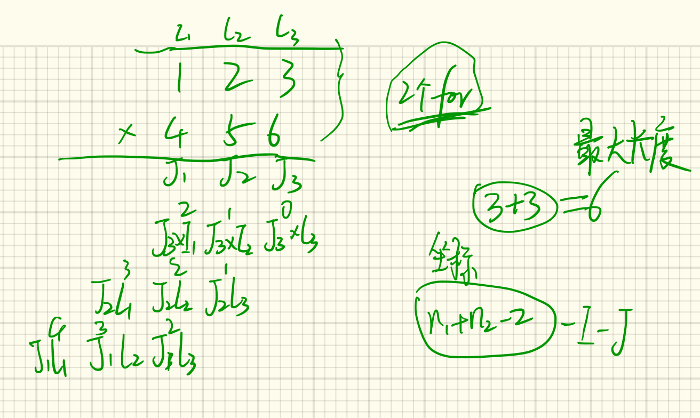

# 43. 字符串相乘

```
输入: num1 = "123", num2 = "456"
输出: "56088"
```

| 解法     | 思路                                                         | 时间复杂度 | 空间复杂度 |
| -------- | ------------------------------------------------------------ | ---------- | ---------- |
| 按位相乘 | <u>拆分字符串，按位相乘</u><br />**注意**：<br />1. 字符串相乘，长度不会超过字符串数量之和<br />2. 计算中间值的下标<br />3. 进位要多遍历一次，别忘记去除开头0<br />  | s1*s2      | s1+s2      |
